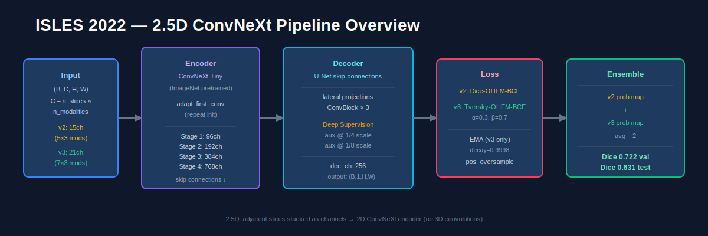
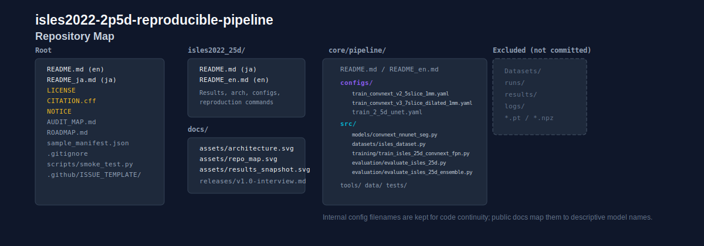
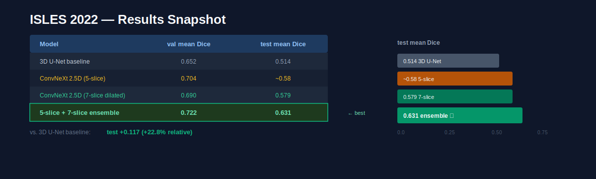

# isles2022-2p5d-reproducible-pipeline

**言語:** 日本語 | [English](README.md)

ISLES 2022 向けの、**再現可能な 2.5D 脳梗塞病変セグメンテーションパイプライン**です。監査しやすいドキュメント、複数スライス入力の ConvNeXt 構成、アンサンブル評価を含みます。

**クイックリンク**
- 英語入口: [isles2022_25d/README_en.md](isles2022_25d/README_en.md)
- 日本語入口: [isles2022_25d/README.md](isles2022_25d/README.md)
- 実験詳細: [isles2022_25d/README.md](isles2022_25d/README.md)
- 引用情報: [CITATION.cff](CITATION.cff)
- リリースノート原稿: [docs/releases/v1.0-interview.md](docs/releases/v1.0-interview.md)
- ロードマップ: [ROADMAP.md](ROADMAP.md)

## このリポジトリでできること

- ISLES 2022 病変セグメンテーションの学習 → 評価 → アンサンブル評価ワークフロー
- 2.5D ConvNeXt ベースラインとして、5 スライス構成と 7 スライス dilated 構成の設計差分を比較
- フル 3D より軽量な構成での病変セグメンテーション実験
- 外部レビュー向けに整理したポートフォリオ導線
- 実データなしで公開物の配線を確認できる簡易動作確認

## 内部ファイル名の対応表

設定ファイル名や学習済み重みの例では、過去の内部実験名が残っています。公開文書では次の意味で読めるようにしています。

| ファイル中の内部名 | 公開文書での意味 |
|---|---|
| `convnext_v2_5slice_1mm` | 5 スライス ConvNeXt 構成 |
| `convnext_v3_7slice_dilated_1mm` | 7 スライス dilated ConvNeXt 構成 |

## 想定している読者

- 医療AIセグメンテーション実装を確認したい採用担当
- 監査しやすい MRI セグメンテーション基盤を見たい ML エンジニア
- 再現性重視の ISLES 系 2.5D プロジェクト構成を探している研究者

## 3分で分かる概要







### 代表指標

| 指標 | 値 | 意味 |
|---|---:|---|
| Local test mean Dice | 0.631 | 公開レシピの実用的な性能目安 |
| Validation mean Dice | 0.722 | 2 つの ConvNeXt 構成を組み合わせたアンサンブルの検証性能 |
| 3D U-Net baseline test Dice | 0.514 | 局所比較の基準値 |
| Relative gain vs 3D baseline | +22.8% | 2.5D アンサンブルによる改善幅 |

> 数値は同梱レシピと評価メモに基づきます。医療データ本体は公開物に含めていません。

## 最短の確認方法

### 1. 実データなしで配線確認

```bash
python scripts/smoke_test.py --use_dummy_data
```

### 2. 配布物マニフェストを確認

```bash
cd core/pipeline
python tools/make_manifest.py
```

### 3. 実データで学習 / 評価

- 日本語詳細: [isles2022_25d/README.md](isles2022_25d/README.md)
- 英語版の詳細ガイド: [isles2022_25d/README_en.md](isles2022_25d/README_en.md)

## 含まれるものと含まれないもの

含まれるもの:
- ソースコード
- 設定ファイル
- 監査 / 評価ドキュメント
- 静的図表と release note 原稿

含まれないもの:
- `Datasets/`
- `runs/`
- `results/`
- `logs/`

## 固定スナップショット（ポートフォリオ用）

開発は継続中ですが、ポートフォリオ / 面接レビュー用の固定版は次のタグです。

✅ `isles2022-2p5d-v1.0-interview`

## 引用

[CITATION.cff](CITATION.cff) を参照してください。

## コミットメッセージの規約

今後の変更は Conventional Commits（`type: summary`）で揃えます。

- `fix: eval スクリプトの閾値デフォルト値修正`
- `feat: add ensemble calibration notes`
- `refactor: slice sampler validation`
- `docs: clarify 5-slice vs 7-slice evaluation protocol`
