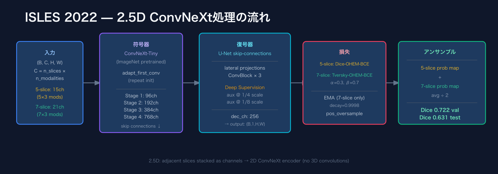
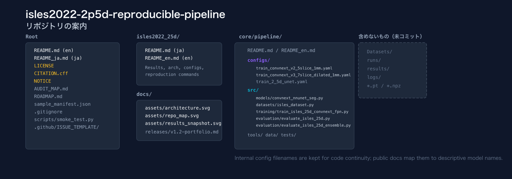
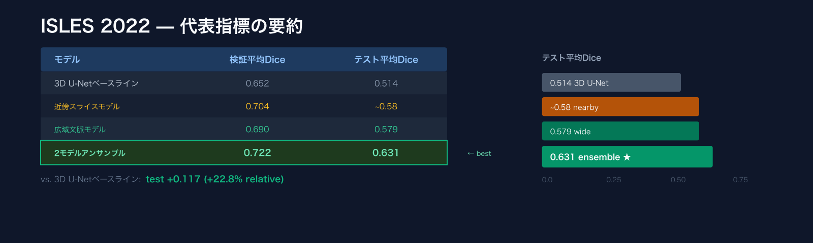

# isles2022-2p5d-reproducible-pipeline

**言語:** 日本語 | [英語版](README.md)

本リポジトリは、ISLES 2022 向けの再現可能な 2.5D 脳梗塞病変セグメンテーションパイプラインを公開する。監査しやすい文書、同系統の 2 モデル、アンサンブル評価を含む。

> 研究およびポートフォリオ提示を目的とする。**医療機器ではない。** 医療データ本体は公開物に含めない。

**関連リンク**

- 英語版入口: [isles2022_25d/README_en.md](isles2022_25d/README_en.md)
- 日本語版詳細: [isles2022_25d/README.md](isles2022_25d/README.md)
- 引用: [CITATION.cff](CITATION.cff)
- リリースノート（v1.2）: [docs/releases/v1.2-portfolio.md](docs/releases/v1.2-portfolio.md)
- ロードマップ: [ROADMAP.md](ROADMAP.md)

## 本リポジトリで確認できること

- ISLES 2022 病変セグメンテーションの学習、評価、アンサンブル評価の流れ
- 近傍重視モデルと広域文脈モデルの比較
- フル 3D より軽量な構成での病変セグメンテーション実験
- 外部レビュー向けに整理した文書
- 実データなしでの公開物の動作確認

## 内部ファイル名の対応表

設定ファイル名や学習済み重みの例では、過去の内部実験名が残っている。両者とも基本構成は同じであり、ConvNeXt encoder と U-Net 風 decoder を用いる。

| ファイル中の内部名 | 公開文書での意味 |
|---|---|
| `convnext_v2_5slice_1mm` | 近傍重視モデル（5 スライス） |
| `convnext_v3_7slice_dilated_1mm` | 広域文脈モデル（7 スライス dilated） |

## 処理構成

<p align="center"></p>

<p align="center"></p>

<p align="center"></p>

### 代表指標

| 指標 | 値 | 意味 |
|---|---:|---|
| ローカルテストの平均 Dice | 0.631 | 公開レシピの実用的な性能目安 |
| 検証の平均 Dice | 0.722 | 2 モデルを組み合わせたアンサンブルの検証性能 |
| 以前この文書が使っていた 3D の値 | 0.514 | このリポジトリが以前書いていた数字。現在の 3D リポジトリの見出しではない |
| 現在の 3D リポジトリのローカルテスト Dice | 0.622 | `isles2022-3d-reproducible-pipeline`、しきい値 0.20、25 例 |
| その現行値との差 | 0.009 | 0.631 − 0.622。25 例では誤差の範囲 |

> 0.631 を、現在の 3D リポジトリに対する +22.8% とは読まない。あの百分率は 0.514 を基準にしており、比較の見出しには使わない。数値は設定に依存する。医療データ本体は公開物に含めない。研究実装であり、**医療機器ではありません**。

## 医療データを用いず動作を確認する手順

```bash
python scripts/smoke_test.py --use_dummy_data
```

```bash
cd core/pipeline
python tools/make_manifest.py
```

実データによる学習・評価は [isles2022_25d/README.md](isles2022_25d/README.md) を参照する。

## 公開範囲

含むもの: ソース、設定、監査・評価文書、静的図表、リリースノート原稿。

含めないもの: `Datasets/`、`runs/`、`results/`、`logs/`。

## スナップショット

固定した公開スナップショットのタグは `isles2022-2p5d-v1.2-portfolio` である。

## 引用

[CITATION.cff](CITATION.cff) に従う。

## コミットメッセージ

Conventional Commits（`fix:`、`feat:`、`docs:` 等）に統一する。
